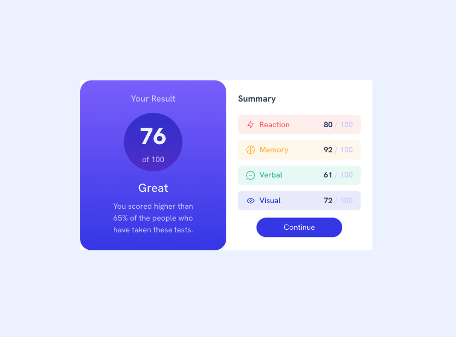

# Frontend Mentor - Results summary component solution

This is a solution to the [Results summary component challenge on Frontend Mentor](https://www.frontendmentor.io/challenges/results-summary-component-CE_K6s0maV). Frontend Mentor challenges help you improve your coding skills by building realistic projects. 

## Table of contents

- [Overview](#overview)
  - [The challenge](#the-challenge)
  - [Screenshot](#screenshot)
  - [Links](#links)
- [My process](#my-process)
  - [Built with](#built-with)
  - [What I learned](#what-i-learned)
  - [Continued development](#continued-development)

## Overview

### The challenge

Users should be able to:

- View the optimal layout for the interface depending on their device's screen size
- See hover and focus states for all interactive elements on the page

### Screenshot



### Links

- [Live Site URL](https://github.com/francoisbillet/FEM-results-summary-component)

## My process

### Built with

- Semantic HTML5 markup
- CSS custom properties
- Flexbox
- CSS Grid
- Mobile-first workflow
- BEM convention naming for classes

### What I learned

- Utility of BEM naming convention to better understand who is responsible for what, to be consistent with class naming and ease the process of maintaining the app.
- Use of utility classes such as `flex-group` to avoid duplicating A LOT of code
- Use of **locally-scoped** custom properties in Block element (BEM convention) to handle general/layout properties usually declared in children elements. It is also easier to maintain because we don't have to dig 10 levels down to modify a padding or spacing between elements.
- Display SVG icons using pseudo-element `::before` (with a *content*):
```css
.summary__category__name[data-icon]::before {
  content: "";
  width: 20px;
  height: 20px;
}

.summary__category__name[data-icon="reaction"]::before {
  background-image: url("assets/images/icon-reaction.svg");
}
```

### Continued development

- Keep practicing naming classes using BEM convention
- See the big picture for creating reusable classes to avoid writing too much code
